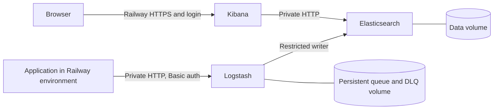

# Deploy ELK Stack: Elasticsearch, Logstash, Kibana on Railway

ELK Stack with authenticated JSON intake and persistent logs.

## About

Authenticated JSON logs, persistent storage, and Kibana search on Railway.

[Try the live demo](https://kibana-production-43ee.up.railway.app/app/dashboards#/view/showcase-commerce).
Log in with username `demo` and password `PublicDemo2026!`.
This shared account has read-only access to synthetic logs.

Only Kibana is public. Private service traffic is unencrypted HTTP inside the
Railway environment. Do not expose Elasticsearch or Logstash publicly with this configuration.

## What gets deployed

| Service | Source | Type |
|---------|--------|------|
| Elasticsearch | [kayossouza/railway-elk](https://github.com/kayossouza/railway-elk) (root: /elasticsearch) | Database |
| Kibana | [kayossouza/railway-elk](https://github.com/kayossouza/railway-elk) (root: /kibana) | Web service |
| Logstash | [kayossouza/railway-elk](https://github.com/kayossouza/railway-elk) (root: /logstash) | Database |

## Environment variables

| Variable | Service | Default | Description |
| --------- | ------- | ------- | ----------- |
| `PORT` | Elasticsearch | 8081 | Readiness probe port |
| `KIBANA_PASSWORD` | Elasticsearch | (secret) | - |
| `ELASTIC_PASSWORD` | Elasticsearch | (secret) | - |
| `LOGSTASH_PASSWORD` | Elasticsearch | (secret) | - |
| `PORT` | Kibana | 8082 | Readiness probe port |
| `KIBANA_PASSWORD` | Kibana | (secret) | - |
| `PORT` | Logstash | 9600 | Readiness API port; intake uses 8080 |
| `INPUT_PASSWORD` | Logstash | (secret) | - |
| `LOGSTASH_PASSWORD` | Logstash | (secret) | - |

## Configuration

- **Healthcheck:** `/ready`
- **Volume:** `/usr/share/elasticsearch/data`
- **Networking:** Public domain with automatic HTTPS
- **Healthcheck:** `/_node/pipelines/main`
- **Volume:** `/usr/share/logstash/data`

**Category:** Observability · **Languages:** Python, JavaScript, Dockerfile, Shell

[View on Railway →](https://railway.com/deploy/elk-stack-2)
